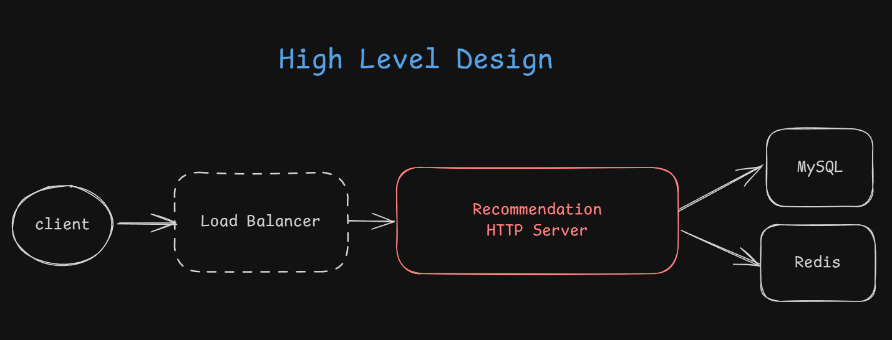
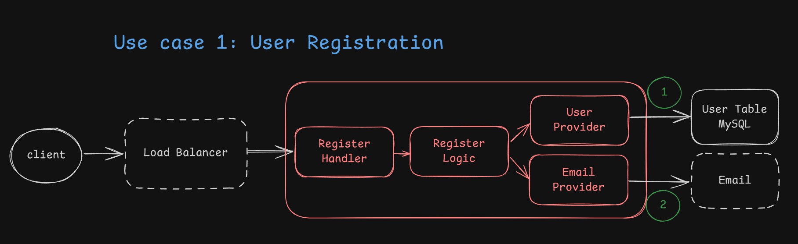
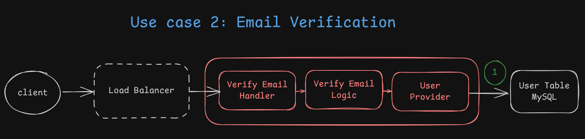
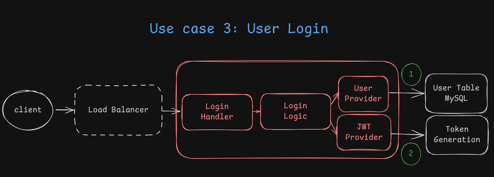
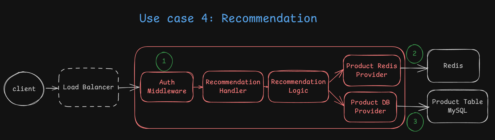

## High level design

### Layered Architecture

There are three layers

- `Handler Layer` – **Manages input/output**, request validation, and response formatting.
- `Logic Layer` – **Implements business logic**
- `Provider Layer` – **Handles I/O operations** like database queries, Redis access, and JWT generation.

## Use case 1: User Registration

1. Insert new user to database
2. Send email (Just printing log into stdout for now)

### API

`POST /user/register`

- Request Body (JSON):
  - email
  - password (For ease of testing, the password will be sent without encryption)
- Response:
  - 200 -> OK
  - 400 -> Invalid email or password
  - 409 -> The email has been taken
  - 500 -> Unknown error

## Use case 2: Email Verification

1. update the user as verified

### API

`GET /user/verify-email?token=xxx`

- Response:
  - 200 -> OK
  - 400 -> Invalid token
  - 404 -> Token not found
  - 409 -> The email has been verified
  - 500 -> Unknown error

## Use case 3: User Login

1. Check if user exists in db and it's verified
2. Generate json web token

### API

`POST /user/login`

- Request Body (JSON):
  - email
  - password (For ease of testing, the password will be sent without encryption)
- Response:
  - 200 -> OK
    - Response Body (JSON):
      - token
  - 400 -> Invalid email or password
  - 403 -> Email not verified
  - 404 -> Email not found or incorrect password ([WHY I choose 404 when the password is incorrect](https://www.reddit.com/r/webdev/comments/swvevq/comment/hxofyyd/?utm_source=share&utm_medium=web3x&utm_name=web3xcss&utm_term=1&utm_content=share_button))
  - 500 -> Unknown error

## Use case 4: Recommendation

1. Authenticate the user
2. Get recommendation from redis
3. Get recommendation from database

### API

`GET /authed/recommendation?cursor=xxx&pageSize=yyy` ([Cursor Pagination](https://www.merge.dev/blog/cursor-pagination))

- Requset Header:
  - Authorization
- Response:
  - 200 -> OK
    - Response Body (JSON):
      - data
      - nextCursor
  - 400 -> Invalid cursor or pageSize
  - 401 -> Unauthorized
  - 500 -> Unknown error

## Database Schema Design

### User Table

| Column             | Data Type    | Nullable | Other                                                 |
| ------------------ | ------------ | -------- | ----------------------------------------------------- |
| user_id            | INT          | X        | AUTO_INCREMENT / PRIMARY KEY                          |
| email              | VARCHAR(255) | X        | UNIQUE                                                |
| encrypted_password | VARCHAR(255) | X        |                                                       |
| token              | VARCHAR(36)  | X        |                                                       |
| created_at         | TIMESTAMP    | X        | DEFAULT CURRENT_TIMESTAMP                             |
| updated_at         | TIMESTAMP    | X        | DEFAULT CURRENT_TIMESTAMP ON UPDATE CURRENT_TIMESTAMP |

### Product Table

(The products are from [Fake Store API](https://fakestoreapi.com/))

| Column      | Data Type    | Nullable | Other                        |
| ----------- | ------------ | -------- | ---------------------------- |
| product_id  | INT          | X        | AUTO_INCREMENT / PRIMARY KEY |
| title       | VARCHAR(127) | X        |                              |
| price       | FLOAT(16,4)  | X        |                              |
| description | MEDIUMTEXT   | X        |                              |
| category    | VARCHAR(63)  | X        |                              |
